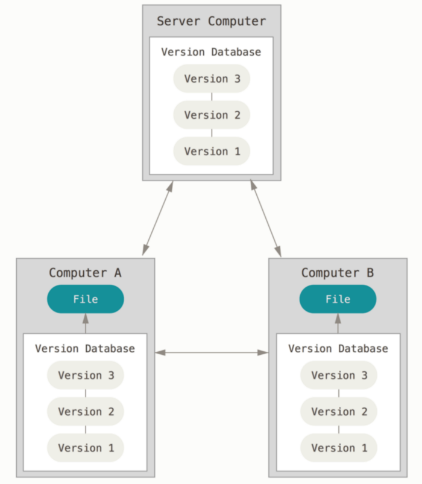
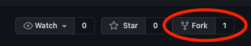
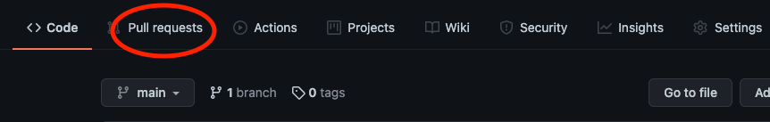
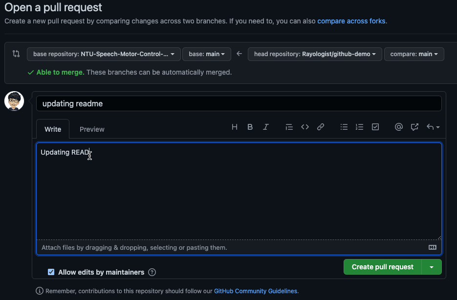

# Why do we use Git?
The following pictures are from: [連猴子都能懂的Git入門指南](https://backlog.com/git-tutorial/tw/)

<figure class="image">
  
  <figcaption align="center" style="font-weight:bold">Problem 1: Chaotic Namings and Versions of Files<figcaption>
</figure>

</br>

<figure class="image">
  
  <figcaption align="center" style="font-weight:bold">Problem 2: Conflicts When Collaborating on the Same Files<figcaption>
</figure>
</br>
<figure class="image">
  
  <figcaption align="center" style="font-weight:bold">Git: Preserving File Versions and Raising Warnings When Modifying the Same Files<figcaption>
</figure>

# What is Git?
The following pictures are from: [Manisha Basra](https://medium.com/swlh/things-about-git-and-github-you-need-to-know-as-developer-907baa0bed79)

1.
<figure class="image">
  
  <figcaption align="center" style="font-weight:bold">Distributed Version Control System</figcaption>
</figure>

2.
<figure class="image">
  
  <figcaption align="center" style="font-weight:bold">Distributed Version Control</figcaption>
</figure>


# Git vs. Github
From the [Stackoverflow](https://stackoverflow.com/questions/13321556/difference-between-git-and-github):

1. Git is a revision (or version) control system, a tool to manage your source code history.

2. GitHub is a hosting service for Git repositories.

3. So they are not the same thing: Git is the tool, GitHub is the service for projects that use Git.

</br>

# Git Commands vs. [Github Desktop](https://desktop.github.com)

### Both are able to do the same things, but using commands will be a lot faster than using Github Desktop.

</br>

# 1. Basic Shell Commands

### 1. **P**rint **C**urrent **D**irectory
```bash
pwd
```

### 2. **C**hange **D**irectory
```bash
cd your/file/path/
```

###  3. **M**a**k**e **Dir**ectroy
```bash
mkdir your/folder/name
```

### 4. **M**o**v**e or rename files

```bash 
# move files
mv your/path/origin_name your/other/path/origin_name
```

```bash 
# rename files
mv origin_name modified_name
```

### 5. **L**i**s**t (files)
```bash
ls your/directory/
```

# 2. Symbols
```bash
/ # root directory
~ # home directory
. # current directory
```


# 3. Github Setup (SSH)


### 1. Check if SSH public key exists
```bash
ls ~/.ssh
```
### 2. If **not**, type:
```bash
ssh-keygen
```

### 3. Copy your ssh key to Github
```bash
# For Mac
pbcopy < ~/.ssh/your.pub 
```

```powershell
# For Windows
clip < ~/.ssh/your.pub
```


# 4. Using Git Verbs


### 1. Fork: make a copy from other's repository



### 2. Clone: download everything in a repository

```bash
git clone git@github.com:NTU-Speech-Motor-Control-Lab/github-demo.git
```

### 3. Status: check Git status

```bash
git status
```

### 3. Add: allow Git to track file changes

```bash
git add your-file-name
```

```bash
git add .
```

### 4. Commit: submit a new version to Git

```bash
git commit -m "your commit message"
```

### 5. Push: updating remote repository

```bash
git push 
```

### <div style="color:red">**NEVER DO THIS Unless You Know What You Are Doing.** </div>
```bash
git push -f
```


### 6. Pull: updating local repository
```
git pull 
```

# 5. Pull Request (PR)

### 1. 



### 2. 


### 3.


### 4.



# 6. Practice

## Add your name and github account below.

*


# 7. Resources

[W3HexShool](https://w3c.hexschool.com/git/fd426d5a) 

[連猴子都能懂的Git入門指南](https://backlog.com/git-tutorial/tw/)

